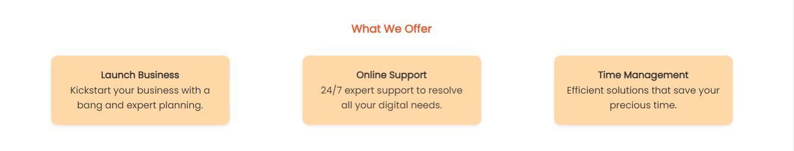
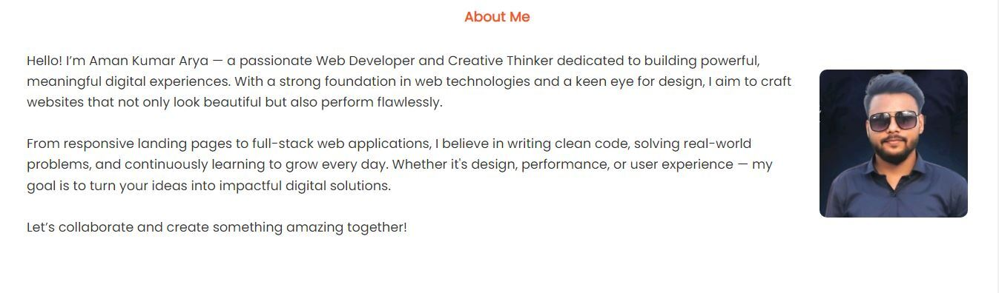
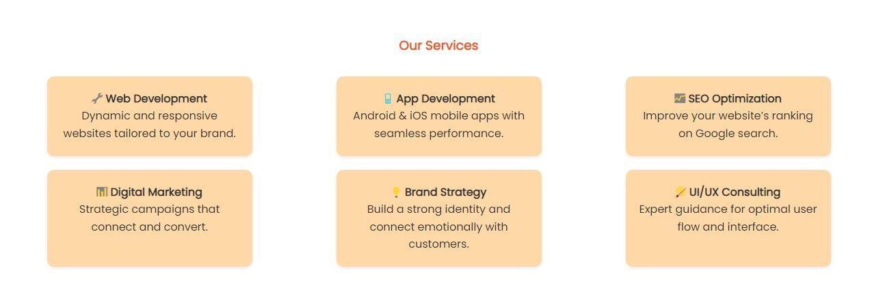

# Landing Page – Task 1 @ CodSoft

Welcome to my Landing Page project, created as part of **Level 1, Task 1** during my web development internship at **CodSoft**. This project showcases a visually appealing, responsive, and informative landing page built using HTML and CSS. It's designed to reflect the essential elements of a modern business or personal brand introduction.

## 📑 Table of Contents
- [About](#about)
- [Features](#features)
- [Services](#services)
- [About Me](#about-me)
- [Contact](#contact)
- [Screenshots](#screenshots)
- [Technologies Used](#technologies-used)
- [How to Run Locally](#how-to-run-locally)
- [License](#license)

---

## 📖 About
This project demonstrates my ability to create structured layouts, implement responsive design, and style elements using modern CSS. From navigation to call-to-actions and informative content, every section is thoughtfully built to reflect real-world use cases.

---

## 🎯 Features
- Fully responsive design for all screen sizes
- Hero section with powerful headline and CTA buttons
- Service offerings displayed in interactive boxes
- Social media integration (Facebook, Twitter, Instagram)
- Clean typography and elegant styling

---

## 💼 Services
The landing page highlights the following digital services:
- 🔧 Web Development
- 📱 App Development
- 📈 SEO Optimization
- 📊 Digital Marketing
- 💡 Brand Strategy
- 🎨 UI/UX Consulting

---

## 👨‍💻 About Me
> I am **Aman Kumar Arya**, a passionate Web Developer and Creative Thinker. With an eye for detail and love for code, I build websites that are clean, fast, and meaningful. This landing page reflects my dedication to front-end design, responsiveness, and digital storytelling.

---

## 📩 Contact
Have questions or suggestions? Feel free to connect:
- 💬 Instagram: [@i_aman_arya](https://www.instagram.com/i_aman_arya/?hl=en)
- 🐦 Twitter: [@aman_arya_a2](https://x.com/aman_arya_a2)
- 📘 Facebook: [@amanaryaji](https://www.facebook.com/amanaryaji)

---
## 📸 Screenshots

### Hero Section  

### Features  

### About Me  

### Services  

## 🛠️ Technologies Used
- HTML5  
- CSS3  
- Font Awesome Icons  
- Google Fonts (Poppins)  
- Responsive Flexbox Layout

---
## 🚀 How to Run Locally

Follow these steps to view the landing page on your local machine:

1. Clone the repository: git clone https://github.com/amanarya1311/CODSOFT.git
2. Navigate to the project folder: cd "Level 1 Task 1 Landing Page"
3.  Open the Index.html file in your web browser:

You can double-click the Index.html file, OR

Right-click on it and select "Open with" > your preferred browser, OR

Use a Live Server extension in VS Code (recommended for real-time changes).

## 📄 License

This project is licensed under the MIT License - see the [LICENSE](License) file for details.

