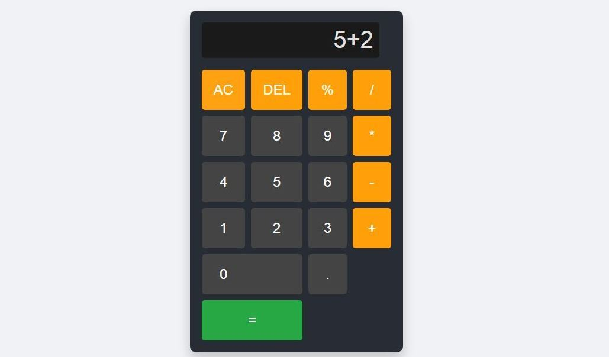

# 🧮 Calculator Web App – Task 3 @ CodSoft

Welcome to my Calculator Web App project, developed as part of **Level 1, Task 3** during my web development internship at **CodSoft**. This project showcases a clean and responsive calculator interface where users can perform basic arithmetic operations with ease. It’s designed with pure **HTML, CSS, and JavaScript**, emphasising both functionality and aesthetic simplicity.

## 📑 Table of Contents
- [About](#about)
- [Features](#features)
- [Skills](#skills)
- [Screenshots](#screenshots)
- [Technologies Used](#technologies-used)
- [How to Run Locally](#how-to-run-locally)
- [License](#license)

---

## 📖 About

This project demonstrates my ability to create an interactive user interface from scratch using core web technologies. The calculator provides functionality for addition, subtraction, multiplication, division, percentage, decimal operations, and also includes utility functions like backspace and clear. Every aspect—from button behaviour to error handling—is managed through custom JavaScript logic, reinforcing my understanding of **DOM manipulation** and **event-driven programming**.

---

## 🎯 Features

- Simple and intuitive calculator layout  
- Supports basic arithmetic operations: +, –, ×, ÷  
- Decimal number support  
- Percentage (%) conversion  
- Clear (`C`) and backspace (`⌫`) functions  
- Handles invalid operations like division by zero  
- Responsive design: works well on mobile and desktop screens  
- Styled with modern CSS for a professional look  

---

## 🛠️ Skills

This project helped me strengthen the following technical skills:

**Front-End Technologies:**
- HTML5 – Structuring the calculator layout  
- CSS3 – Styling and making the UI responsive  
- JavaScript – Adding interactivity, arithmetic logic, and DOM handling  

**Concepts Practised:**
- DOM Traversal and Event Handling  
- Conditionals and Arithmetic Operations  
- String and Number manipulation  
- Error handling and validation  
- Responsive Web Design principles  

---

## 📸 Screenshots  
- Calculator Interface  
  

---

## 🚀 Technologies Used

- HTML5  
- CSS3  
- JavaScript (ES6)  
- Font Awesome *(optional for icons)*  
- Google Fonts *(optional for typography)*  

---

## 🖥️ How to Run Locally

To view or run this calculator project locally on your machine:

1. Clone the repository:  
   `git clone https://github.com/amanarya1311/CODSOFT.git`

2. Navigate to the project folder:  
   `cd "level_1_task_3_calculator"`

3. Open the `index.html` file in your browser:

- Double-click `index.html`, or  
- Right-click → Open with your browser, or  
- Use Live Server in VS Code (recommended)

[Demo link](https://amanarya1311.github.io/CODSOFT/level_1_task_3_calculator/)

## 📄 License

This project is licensed under the MIT License – see the [LICENSE](License) file for details.

